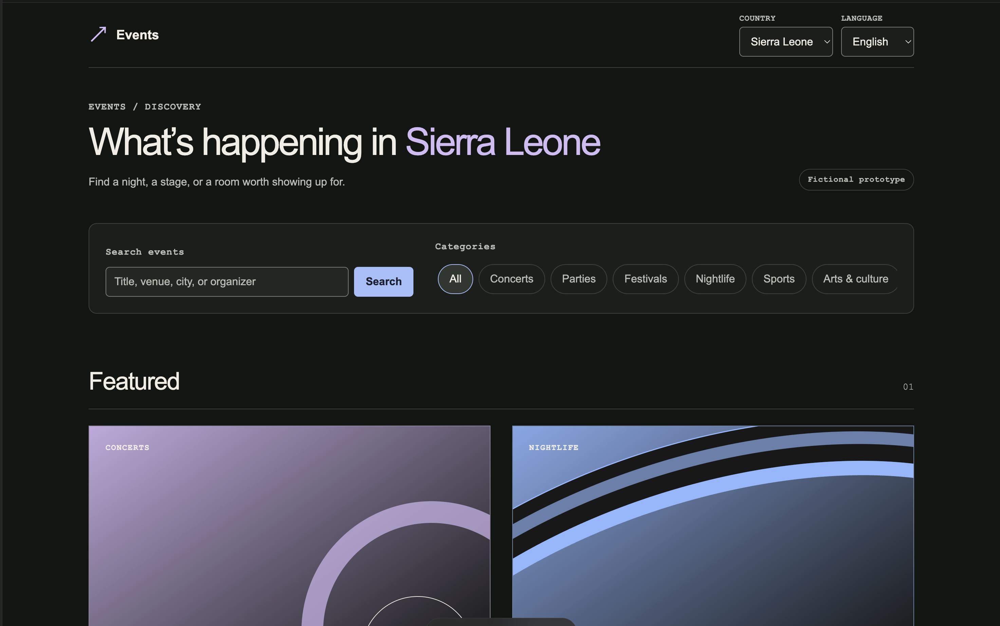

# ticketingprototype

A mobile-first, poster-first public event discovery prototype for Sierra Leone, Ghana, and Côte d’Ivoire. The repository name is retained; no product or company name has been assigned.


 

## Sprint 2 scope

Sprint 2 adds a localized organizer workspace for profile management, event creation and editing, ticket-tier management, explicit publish/unpublish actions, and promotion configuration. The workspace is available at `/[locale]/organizer?country=SL&organizer=open-current-collective`; the selector is clearly prototype-only and does not represent authentication.

Organizer mutations use a server-only prototype context plus domain services that require a `currentOrganizerId` and verify event ownership. Browser URL values select the demo context but are never the ownership check themselves. The UI does not import fixture records. `src/modules/prototype-data` owns the process-local mutable repository, so organizer changes reset whenever the development server restarts. A future PostgreSQL repository can replace this adapter without changing forms or domain rules.

The workspace provides counts derived from real fixture state: events, publication states, upcoming events, tiers, and active promotions. It does not fabricate sales, revenue, customers, redemptions, attendance, or payouts.

Promotion configuration exists in Sprint 2, but promotion redemption and financial fee interaction are deferred until checkout/payment sprints.

## Public Sprint 1 scope

Sprint 1 adds country-aware event discovery, localized search and category filtering, reusable event cards, shareable event detail pages, ticket-tier pricing, and derived availability states. The data is explicitly fictional and the pages are marked as a prototype. Ticket purchasing is intentionally unavailable.

The root route redirects to `/en?country=SL`. Public routes are:

- `/[locale]?country=SL&q=...&category=...` for event discovery.
- `/[locale]/events/[slug]?country=SL` for a public event.

`locale` supports `en` and `fr`. The selected country remains in query state, preserving the Sprint 0 market architecture. A detail URL with the wrong country redirects to the event venue’s country; unknown or non-published slugs return the localized not-found page.

## Event architecture

`src/modules/events` owns the public event domain:

| Location           | Responsibility                                                                   |
| ------------------ | -------------------------------------------------------------------------------- |
| `domain.ts`        | Typed event, venue, ticket, artwork, status, and money contracts.                |
| `categories.ts`    | Extensible category vocabulary and stable URL slugs.                             |
| `availability.ts`  | Derived ticket availability with deterministic reason precedence.                |
| `money.ts`         | Exact minor-unit construction, comparison, and display formatting.               |
| `repository.ts`    | Data-access interface used by public queries.                                    |
| `public-events.ts` | Published-event lookup, country/category filtering, and normalized text search.  |
| `fixtures/`        | The only source of fictional event records and their fixture repository adapter. |

UI components receive event records through `public-events.ts`; they do not import fixture arrays. A future Prisma repository can implement `EventRepository` without changing cards, discovery filters, or detail components.

Organizer modules follow the same boundary:

| Location                     | Responsibility                                                                                         |
| ---------------------------- | ------------------------------------------------------------------------------------------------------ |
| `src/modules/organizers`     | Organizer domain, validation, ownership-aware event/tier/promotion services, and repository contracts. |
| `src/modules/promotions`     | Promotion contracts, normalization, schedule state, and exact preview arithmetic.                      |
| `src/modules/prototype-data` | Mutable process-local implementation shared by public and organizer server queries.                    |
| `src/app/[locale]/organizer` | Localized workspace routes and server actions.                                                         |

The fixture source contains nine published prototype events, evenly distributed across the three markets. It covers concerts, nightlife, arts and culture, sports, conferences, and festivals, with distinct dates, venues, currencies, poster treatments, sold-out inventory, and future-sale inventory. Event titles, slugs, IDs, descriptions, prices, and venue details are confined to the fixture layer.

Search runs on the small server-side fixture set and matches normalized event title, venue, city, and organizer text. Category and search state use URL query parameters, so filtered pages remain refreshable, linkable, and keyboard accessible without a client search library.

## Database model

PostgreSQL and Prisma remain the production data foundation. `Country` stores identity only; currency, locale, language, payment configuration, and market settings remain in `src/config/countries.ts`.

- `Venue`: UUID, name, optional address, city, country relation, timestamps.
- `Organizer`: UUID, unique slug, display name, optional about text, timestamps.
- `Event`: UUID, global unique slug, nullable organizer relation, legacy organizer display name, title, description, typed category, optional artwork reference, venue relation, start/end timestamps, typed publication status, optional age restriction and featured rank, refund policy, publish timestamp, timestamps.
- `TicketTier`: UUID, event relation, name, optional description, exact minor-unit price, explicit three-letter currency, capacity, available quantity, sales window, timestamps.
- `Promotion`: UUID, event relation, event-local normalized code, label, typed discount shape, schedule, optional usage limit and attribution, active state, timestamps.
- `PromotionTicketTier`: optional tier restriction with composite foreign keys and a same-event check.

The organizer migration is deliberately phased. It adds nullable `Event.organizerId`, creates stable organizer records, and seeds relationships for all fixtures while preserving `organizerDisplayName` as a legacy fallback. All events created in Sprint 2 require a real organizer ID. A later production migration can backfill and verify legacy rows before making `organizerId` required and eventually removing the fallback field.

The migration adds indexes for discovery and relations plus database checks for event and sale date order, non-negative price/inventory, availability not exceeding capacity, and positive featured ranks. Country is derived through the venue rather than duplicated on Event. Ticket availability is derived rather than persisted:

1. Before `salesStart`: `SALE_NOT_STARTED`
2. After `salesEnd`: `SALE_ENDED`
3. `availableQuantity === 0`: `SOLD_OUT`
4. Otherwise: `AVAILABLE`

The seed is repeatable and upserts country identifiers, organizers, venues, events, ticket tiers, promotions, and tier restrictions.

## Money representation

Persisted prices use PostgreSQL `BIGINT` minor units plus `CHAR(3)` currency. Public fixture/DTO values use a base-10 integer string plus a typed currency so they remain exact and JSON-safe. Formatting parses the string as `bigint`, separates whole and fractional units using the market registry’s currency precision, and then applies `Intl` placement/grouping without converting money to a floating-point number. SLE and GHS use two fraction digits; XOF uses zero.

Percentage discounts use integer basis points: `2000` means `20.00%`. Fixed discounts use the same integer minor-unit plus explicit-currency structure as tickets. Preview calculations use `bigint`; a fixed discount may equal an applicable tier price and produce zero, but cannot exceed it. No negative amount is clamped.

Ticket availability remains system-controlled. New tiers begin with availability equal to capacity. Existing fixture availability is preserved on edit, and a capacity below the current available quantity is rejected. No sales count or transactional inventory is inferred.

## Local setup

Node.js 24 and pnpm 11.19.0 must already be available. This repository does not install machine-level prerequisites.

```sh
node --version
pnpm --version
pnpm install --frozen-lockfile
pnpm dev
```

Open `http://127.0.0.1:3000`. UI, lint, types, unit tests, Prisma client generation/schema validation, and the production build do not require PostgreSQL or an `.env` file.

For database work only, copy `.env.example` to `.env` and supply a local PostgreSQL connection. Use an existing PostgreSQL installation or the optional Compose service; do not install Docker solely for this project and do not substitute SQLite.

```sh
docker compose up -d postgres
pnpm db:generate
pnpm db:validate
pnpm db:deploy
pnpm db:seed
pnpm db:check
```

Migration deployment, seeding, and live database checks remain unverified until PostgreSQL is available locally. CI is prepared to run them against a disposable PostgreSQL service after an approved push.

## Verification commands

| Command             | Purpose                                                                     |
| ------------------- | --------------------------------------------------------------------------- |
| `pnpm format:check` | Check repository formatting.                                                |
| `pnpm lint`         | Run ESLint with zero warnings.                                              |
| `pnpm typecheck`    | Generate Prisma/Next types and run strict TypeScript.                       |
| `pnpm test`         | Run country, localization, environment, discovery, status, and money tests. |
| `pnpm db:validate`  | Validate Prisma schema without a live database.                             |
| `pnpm build`        | Generate Prisma Client and create the production Next.js build.             |
| `pnpm check`        | Run lint, types, tests, formatting, and build.                              |

## Design and accessibility

The interface extends the Sprint 0 charcoal editorial shell. Central tokens in `src/styles/tokens.css` control surfaces, type, spacing, focus, status, and expressive poster colors. Six CSS artwork treatments let fictional posters carry the visual variation while real organizer uploads can later replace the `EventArtwork` implementation.

The experience uses semantic headings and cards, complete-link card targets, labeled native controls, visible focus, explicit status text, 44px controls, responsive grids, a no-results state, reduced-motion support, and layouts that avoid horizontal page overflow at narrow widths.

## Deferred functionality and policy

Sprint 2 does not include authentication, durable organizer persistence, checkout, orders, promotion redemption, usage decrementing, payment providers or credentials, platform-fee effects, refunds, ticket issuance, QR codes, scanning, payouts, reserves, or transaction-derived analytics.

Platform fee percentage and discount basis, discount approval limits, co-funding, processing-fee responsibility, payout timing, reserves, and organizer trust tiers remain undecided. No defaults for those policies exist in code. Future checkout and payment services can consume the independent promotion configuration after those decisions are made.
